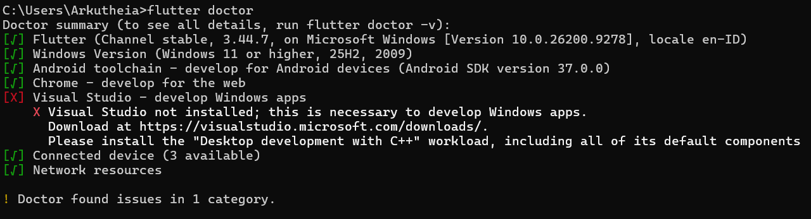
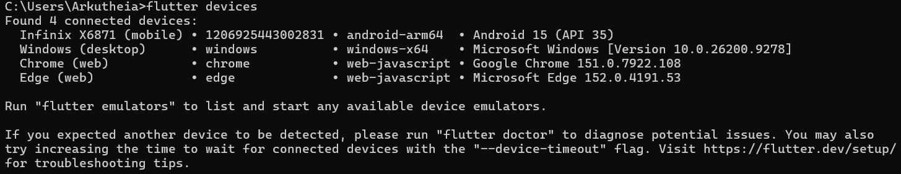

# Week 1 - Mobile Development Ecosystem & Flutter Refresh

---

## Checklist Verifikasi
- [x] `flutter doctor` tidak memiliki masalah yang menghambat target Android..

- [x] `flutter devices` mendeteksi emulator/perangkat fisik.

(01-week-1-mobile-development-ecosystem-flutter-refresh/screenshots/flutter-devices.png)
- [x] Aplikasi berjalan dan UI default telah diganti dengan profil sederhana.
- [x] Anda dapat menjelaskan perbedaan hot reload dan hot restart.
- [x] Repository remote berisi source code, README, screenshot, dan riwayat commit.

---

## Mini Assignment
[Mini Assignment](screenshots/mini-assignment.png)
### Kendala
Kendala mungkin saat di konfigurasi android studio untuk bisa gunakan flutter sebagai aplikasi android

---

## Hot Reload vs Hot Restart

### Hot Reload
Hot reload itu menerapkan perubahan pada kode saat aplikasi sedang berjalan tanpa kehilangan state atau keadaan pada aplikasi terakhir Dengan mengubah tampilan atau layout secara cepat karena perubahan terlihat dalam waktu singkat tanpa restart atau refresh.

### Hot Restart
Hot restart itu menghentikan dan menjalankan ulang aplikasi dari awal sehingga prosesnya lebih lambat dibanding hot reload tetapi berguna ketika perubahan besar memengaruhi state aplikasi atau ketika kita ingin memastikan aplikasi dimulai ulang sepenuhnya atau mungkin saat mengalami error yang fatal.

---

## Refleksi

### 1. Kapan native lebih tepat dipilih daripada cross-platform?
Native lebih tepat dipilih ketika membutuhkan aplikasi yang menuntut performa tinggi atau optimasi yang sangat optimal pada perangkat terterntu karena cross-platform kurang bisa menangani itu walaupun bisa menangani membuat banyak aplikasi tanpa perlu ngoding di berbagai bahasa nativr

### 2. Bagaimana perubahan state berhubungan dengan widget tree dan UI deklaratif?
Di Flutter state itu menentukan data yang sedang digunakan. Jadi ketika state berubah widget tree akan dibangun ulang secara deklaratif dan tanpa mengubah UI satu satu sehingga tampilan UI menyesuaikan dengan data terbaru tanpa perlu mengubah tampilan secara langsung.

### 3. Mengapa commit kecil dengan pesan jelas bermanfaat bagi pekerjaan tim dan portfolio?
Karena commitan kecil bisa membantu tim untuk melihat perubahan secara spesifik sehingga dapat meminimalkan konflik dan mempermudah koordinasinya. Klo untuk portfolio commitan yang rapi dan jelas dapat menunjukkan proses belajar dan kualitas yang kita kerjakan berasa lebih profesional.