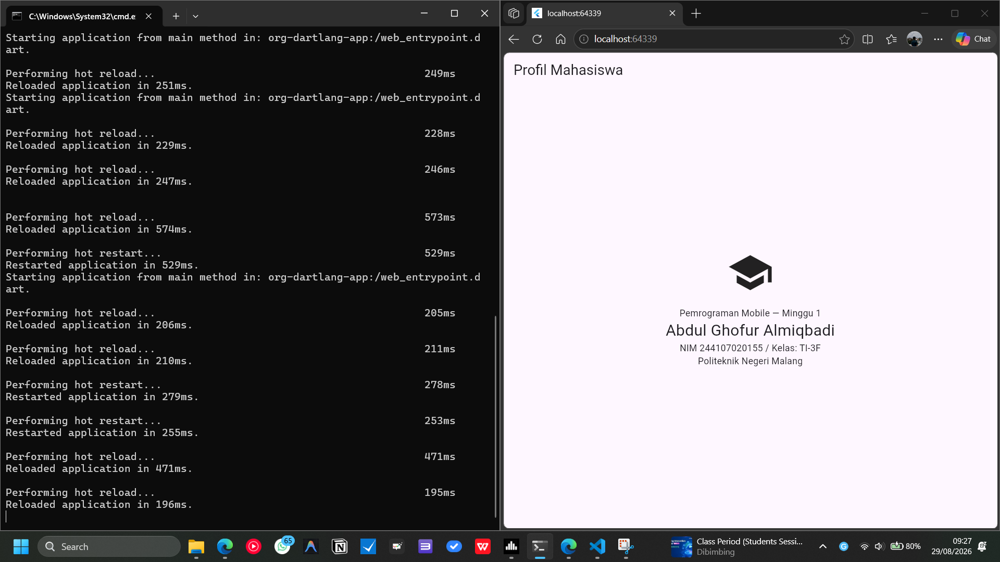
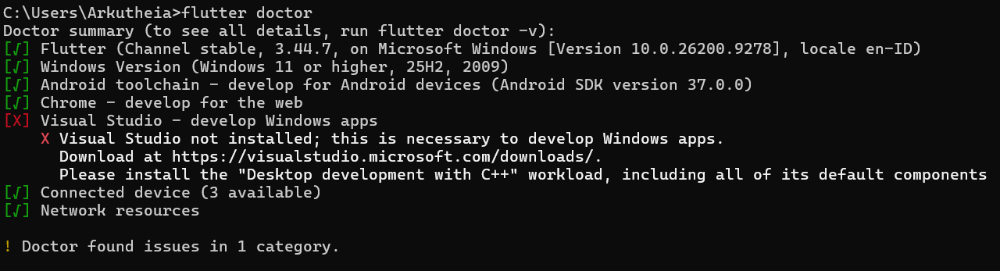
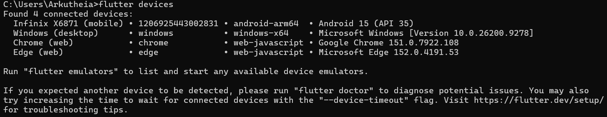

# profil-app
File: [profil-app](lib/main.dart)

# dart-refresh
File: [dart-refresh](lib/dart-refresh.dart)

# Tugas utama
File: [tugas-utama](lib/main.dart)

---

# Checklist Verifikasi
- [x] flutter doctor tidak memiliki masalah yang menghambat target Android.

- [x] flutter devices mendeteksi emulator/perangkat fisik.

- [x] Aplikasi berjalan dan UI default telah diganti dengan profil sederhana.
- [x] Anda dapat menjelaskan perbedaan hot reload dan hot restart.
- [x] Repository remote berisi source code, README, screenshot, dan riwayat commit.

---

# Mini Assignment

### Kendala
Kendala ditemui yaitu pada konfigurasi Android Studio dimana supaya Flutter dapat digunakan untuk membuat aplikasi. Cara mengatasinya dengan memeriksa ulang SDK Manager dan memastikan Android SDK dan emulator terpasang, lalu menjalankan ulang flutter doctor sampai tidak ada masalah lagi.

---

# Hot Reload vs Hot Restart

### Hot Reload
Hot reload yaitu perubahan kode saat aplikasi sedang berjalan tanpa menghilangkan state atau kondisi terakhir. Perubahannya yaitu tampilan yang terlihat dalam waktu singkat tanpa restart karena hanya widget yang berubah yang dibangun ulang atau restart.

### Hot Restart
Hot restart yaitu menghentikan dan menjalankan ulang aplikasi dari awal sehingga prosesnya lebih lambat dibanding hot reload. Cara ini berguna ketika perubahan memengaruhi aplikasi secara besar atau ketika ingin memastikan aplikasi dimulai ulang sepenuhnya, misalnya saat terjadi error yang fatal.

---

# Refleksi
1. Kapan native lebih tepat dipilih daripada cross-platform?
   Native lebih tepat dipilih ketika aplikasi menuntut performa tinggi atau optimasi khusus pada perangkat tertentu, karena cross-platform kurang optimal untuk kebutuhan tersebut walaupun dapat menghasilkan banyak aplikasi tanpa menulis kode bahasa native yang berbeda.
2. Bagaimana perubahan state berhubungan dengan widget tree dan UI deklaratif?
   Di Flutter, state menentukan data yang sedang digunakan. Ketika state berubah, widget tree dibangun ulang secara deklaratif tanpa mengubah UI satu per satu, sehingga tampilan menyesuaikan dengan data terbaru tanpa perlu mengubah tampilan secara langsung.
3. Mengapa commit kecil dengan pesan jelas bermanfaat bagi pekerjaan tim dan portfolio?
   Commit kecil membantu tim melihat perubahan secara spesifik sehingga meminimalkan konflik dan mempermudah koordinasi. Untuk portfolio, riwayat commit yang rapi dan jelas menunjukkan proses belajar dan kualitas kerja yang terlihat lebih profesional.

