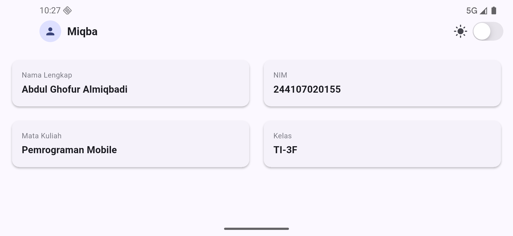
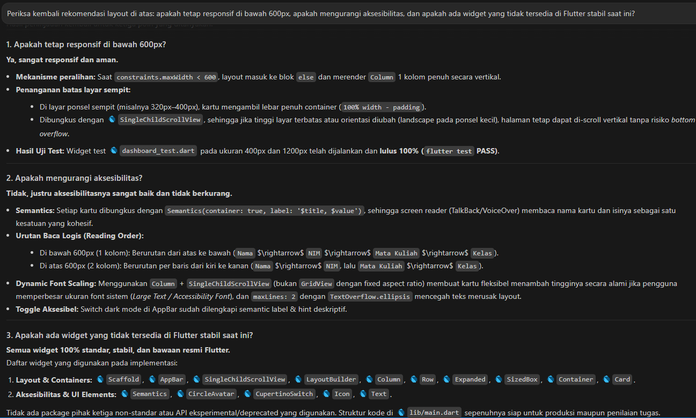

# eksperime-warm-up
File: [tugas-utama](lib/eksperime-warm-up.dart)

# dashboard-responsif
File: [dashboard-responsif](lib/dashboard-responsif.dart)

# Tugas utama
File: [tugas-utama](lib/main.dart)

---

# AI Prompt Challenge
## Prompt desain
### Perbandingan Layout Dashboard Akademik
| Aspek | GridView.count | LayoutBuilder + Column/Row |
|-------|----------------|----------------------------|
| **Kode** | Ringkas, otomatis handle spacing | Verbose, kontrol penuh manual |
| **Fleksibilitas** | Terbatas pada grid seragam | Bisa campur header profil, tombol, divider |
| **Tinggi Kartu** | Dipaksa rasio (`childAspectRatio`) | Mengikuti konten secara natural |
| **Scroll Behavior** | Implicit scrollable (conflict dengan `SingleChildScrollView`) | Natural di dalam `SingleChildScrollView` |
| **Dynamic Content** | Cukup `append` ke `children` | Manual tambah `Row` baru |
---
### Trade-off Responsif
| Aspek | GridView | LayoutBuilder + Column |
|-------|----------|------------------------|
| **Breakpoint Switching** | Smooth — ubah `crossAxisCount` | Smooth — switch antara `Column` dan `Row` |
| **Resize Behavior** | Tinggi berubah berdasarkan rasio | Tinggi tetap konsisten |
| **Tambah Breakpoint** | Mudah — `crossAxisCount: 3` | Harus buat `Row` baru dengan 3 `Expanded` |
| **Orientasi (portrait ↔ landscape)** | Otomatis mengikuti `constraints` | Otomatis, tapi `branch` mungkin perlu ditambah |
---
### Trade-off Aksesibilitas
| Aspek | GridView | LayoutBuilder + Column |
|-------|----------|------------------------|
| **Screen Reader Order** | Membaca per baris (kiri → kanan, lalu bawah) | Membaca sesuai urutan widget tree  |
| **Focus Traversal** | Bisa aneh jika ada elemen focusable di kartu | Lebih predictable (tree flat) |
| **Dynamic Font Size** | Konten bisa terpotong karena rasio tetap  | Teks membesar → kartu ikut membesar  |
| **Semantics** | Sudah menggunakan `Semantics(container: true)`  | Identik  |
---
## Prompt penguatan konsep
**Pilih `GridView.count`** jika dashboard Anda berisi **kartu seragam dalam jumlah dinamis** (misal: daftar mata kuliah dari API) dan mengutamakan kode ringkas.
**Pilih `LayoutBuilder + Column/Row`** jika dashboard memerlukan **campuran widget** (header profil + kartu nilai + tombol aksi), konten bervariasi panjangnya, atau **prioritas aksesibilitas** (font scaling) menjadi penting.

## Verification prompt

# Refleksi
1. Apa perbedaan cara berpikir imperative dan declarative saat membangun UI?
   Untuk imperatif itu seperti memberi perintah langkah demi langkah, sedangkan deklaratif hanya mendeskripsikan hasil akhir yang diinginkan.
2. Kapan Expanded membantu dan kapan penggunaannya justru menghasilkan layout error?
   Penggunaan expanded berguna untuk membagi sisa ruang kosong di dalam Row atau Column yang ukurannya sudah pasti. Namun, akan error jika dipakai di dalam widget yang ukurannya tak terbatas.
3. Bagaimana breakpoint dan theme memengaruhi pengalaman pengguna?
   Jadi breakpoint itu membuat tata letak otomatis menyesuaikan diri agar tetap rapi dan mudah dibaca di berbagai ukuran layar, sedangkan theme menjaga konsistensi warna dan huruf sekaligus mendukung fitur seperti dark mode agar aplikasi nyaman saat dipakai.
4. Apa yang Anda verifikasi dari rekomendasi AI setelah tugas inti selesai?
   Memastikan ketepatan responsivitas breakpoint tanpa overflow, kesesuaian penggunaan widget yang diinstruksikan, aspek aksesibilitas, kestabilan API Flutter yang digunakan dan keberhasilan pengujian otomatis (flutter test) pada berbagai ukuran layar.

