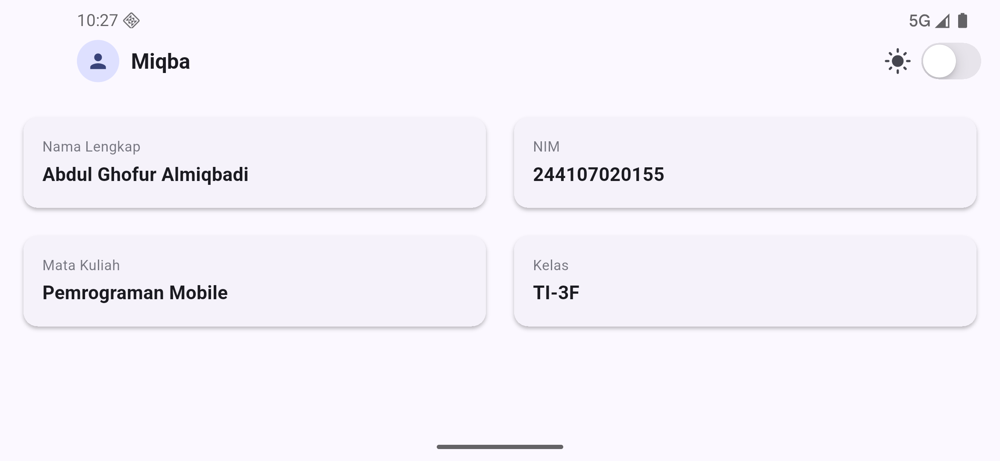
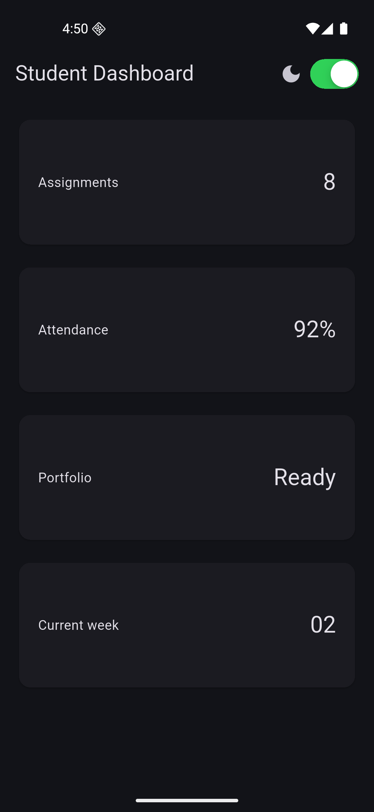
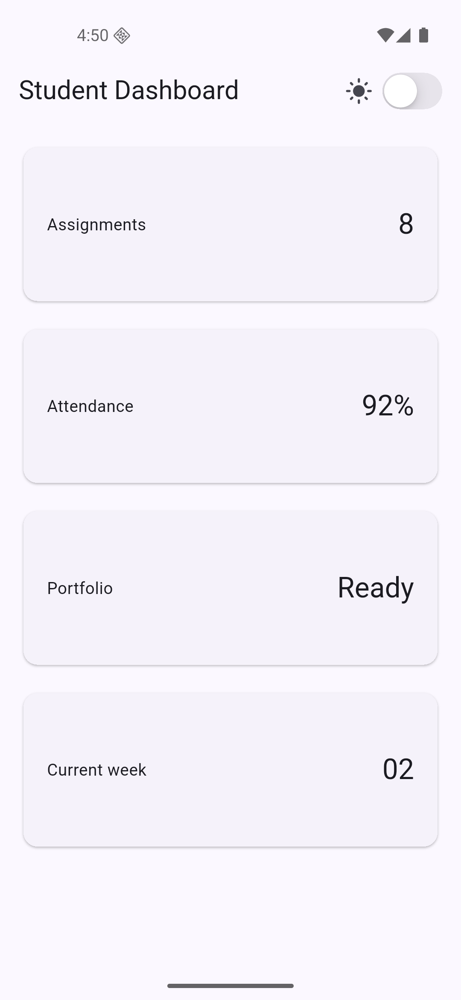
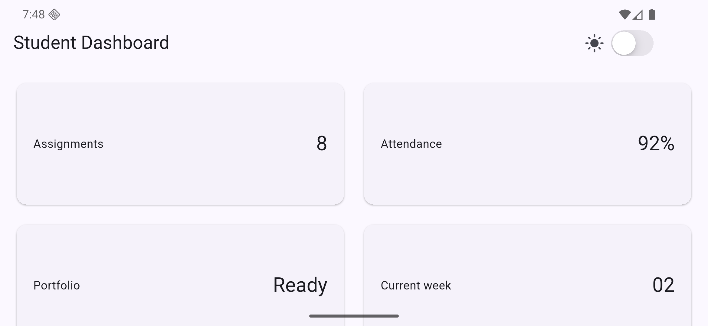
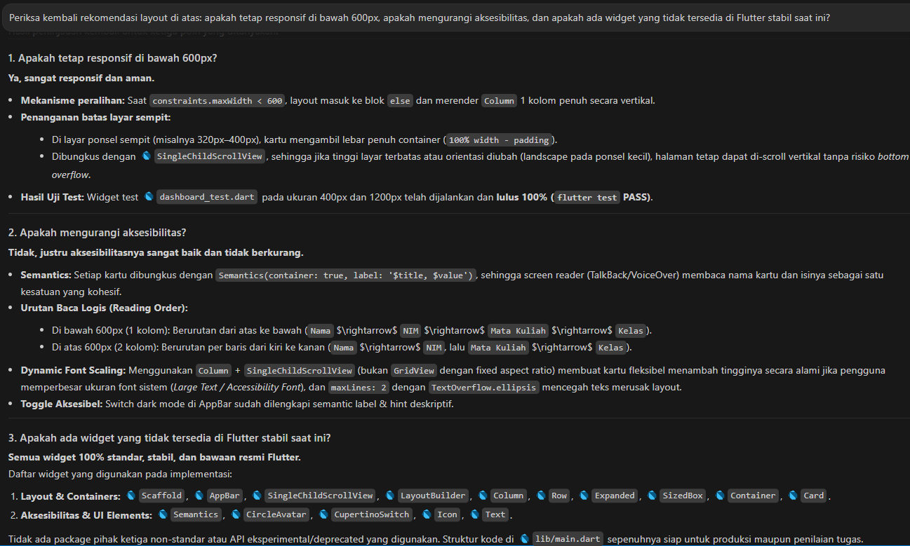

# eksperimen-warm-up
File: [eksperime-warm-up](lib/eksperime-warm-up.dart)

# dashboard-responsif
File: [dashboard-responsif](lib/dashboard-responsif.dart)

# Tugas utama
File: [tugas-utama](lib/main.dart)

---

# AI Prompt Challenge
## Prompt desain
### Perbandingan Layout Dashboard Akademik
| Aspek | GridView.count | LayoutBuilder + Column/Row |
|-------|----------------|----------------------------|
| Kode | Ringkas, otomatis handle spacing | Verbose, kontrol penuh manual |
| Fleksibilitas | Terbatas pada grid seragam | Bisa campur header profil, tombol, divider |
| Tinggi Kartu | Dipaksa rasio (childAspectRatio) | Mengikuti konten secara natural |
| Scroll Behavior | Implicit scrollable (conflict dengan SingleChildScrollView) | Natural di dalam SingleChildScrollView |
| Dynamic Content | Cukup append ke children | Manual tambah Row baru |
---
### Trade-off Responsif
| Aspek | GridView | LayoutBuilder + Column |
|-------|----------|------------------------|
| Breakpoint Switching | Smooth — ubah crossAxisCount | Smooth — switch antara Column dan Row |
| Resize Behavior | Tinggi berubah berdasarkan rasio | Tinggi tetap konsisten |
| Tambah Breakpoint | Mudah — crossAxisCount: 3 | Harus buat Row baru dengan 3 Expanded |
| Orientasi (portrait ↔ landscape) | Otomatis mengikuti constraints | Otomatis, tapi branch mungkin perlu ditambah |
---
### Trade-off Aksesibilitas
| Aspek | GridView | LayoutBuilder + Column |
|-------|----------|------------------------|
| Screen Reader Order | Membaca per baris (kiri → kanan, lalu bawah) | Membaca sesuai urutan widget tree  |
| Focus Traversal | Bisa aneh jika ada elemen focusable di kartu | Lebih predictable (tree flat) |
| Dynamic Font Size | Konten bisa terpotong karena rasio tetap  | Teks membesar → kartu ikut membesar  |
| Semantics | Sudah menggunakan Semantics(container: true)  | Identik  |
---
## Prompt penguatan konsep
Pilih GridView.count jika dashboard berisi kartu seragam dalam jumlah dinamis (misal: daftar mata kuliah dari API) dan mengutamakan kode ringkas.
Pilih LayoutBuilder + Column/Row jika dashboard memerlukan campuran widget (header profil + kartu nilai + tombol aksi), konten bervariasi panjangnya, atau prioritas aksesibilitas (font scaling) menjadi penting.

## Verification prompt

# Refleksi
1. Apa perbedaan cara berpikir imperative dan declarative saat membangun UI?
   Pendekatan imperatif memberi perintah langkah demi langkah untuk mengubah tampilan, sedangkan deklaratif hanya mendeskripsikan hasil akhir berdasarkan state, lalu Flutter yang membangun ulang tampilannya.
2. Kapan Expanded membantu dan kapan penggunaannya justru menghasilkan layout error?
   Expanded membantu membagi sisa ruang kosong di dalam Row atau Column yang ukurannya sudah pasti. Ia menyebabkan error jika dipakai di dalam widget dengan ukuran tak terbatas, misalnya langsung di dalam SingleChildScrollView tanpa pembatas tinggi.
3. Bagaimana breakpoint dan theme memengaruhi pengalaman pengguna?
   Breakpoint membuat tata letak menyesuaikan ukuran layar secara otomatis agar tetap rapi dan mudah dibaca. Theme menjaga konsistensi warna dan huruf, termasuk dukungan dark mode agar aplikasi nyaman digunakan.
4. Apa yang diverifikasi dari rekomendasi AI setelah tugas inti selesai?
   Yang diverifikasi adalah breakpoint responsif tanpa overflow, widget yang dipakai sesuai instruksi, aksesibilitas tidak menurun, API Flutter yang dipakai masih tersedia di versi stabil, dan pengujian otomatis (flutter test) lolos pada berbagai ukuran layar.

