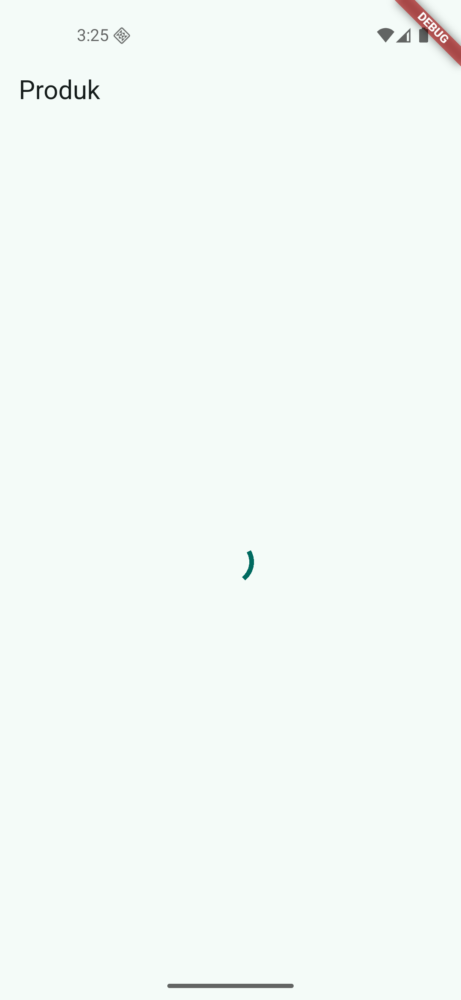
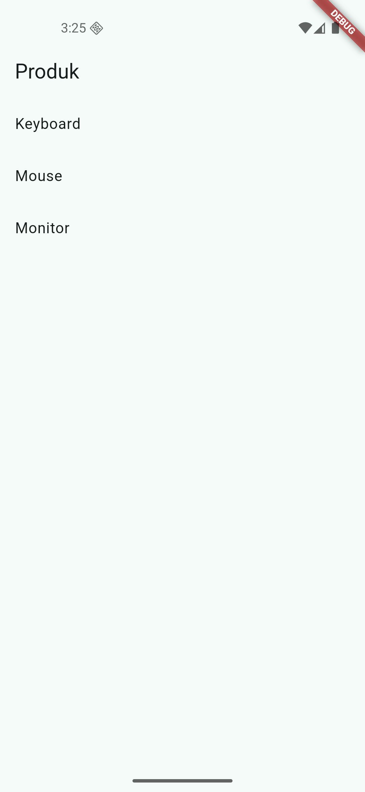
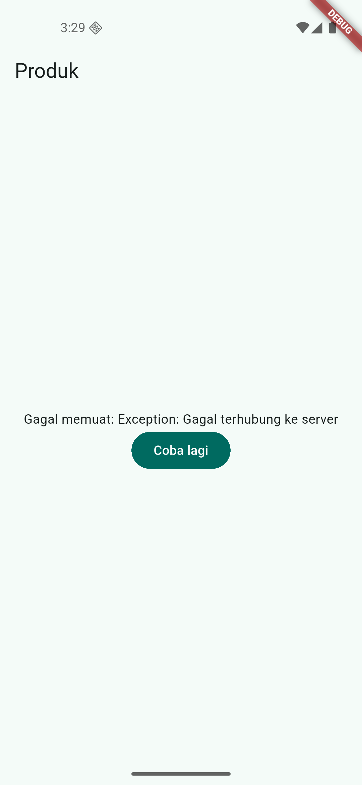
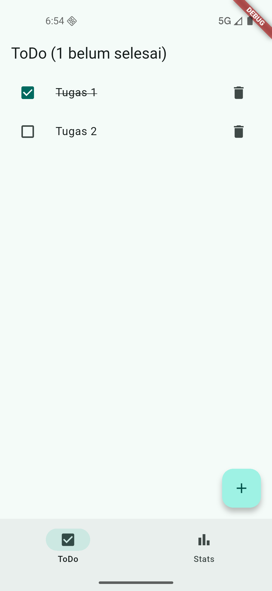
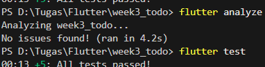

## Refactoring dan testing
### Checklist Verifikasi Mandiri
- [x] Navigasi GoRouter: Berhasil pindah halaman (ToDo <-> Stats) via NavigationBar, state Riverpod tetap bertahan karena ProviderScope di root.
- [x] Refactoring Widget: TodoTile dipisah ke folder widgets/ agar file tidak terlalu panjang dan mudah dirawat.
- [x] Provider Turunan: Berhasil membuat unfinishedTodosProvider menggunakan .where() untuk memfilter data secara reaktif.
- [x] UI AsyncValue: StatsPage menangani loading, error (dengan retry), dan success dengan benar.
- [x] Testing & Quality: flutter analyze bersih dari warning, dan flutter test berhasil mensimulasikan interaksi user (menambah tugas).
- [x] Dokumentasi AI: Prompt, hasil generate, dan hasil verifikasi disimpan rapi di folder docs/.

## Dokumentasi AI
Folder: [Dokumentasi-AI](docs/)

## Tugas dan Refleksi
Folder: [tugas](lib/)
### Refleksi
1. Kapan setState masih cukup, dan kapan state harus naik ke Riverpod?
   setState masih cukup untuk state lokal satu widget, misalnya status tombol atau validasi form di satu halaman. State perlu naik ke Riverpod jika data dipakai di banyak halaman, misalnya daftar ToDo yang tampil di Home sekaligus dihitung di Stats.
2. Apa perbedaan context.go dan context.push, dan kapan masing-masing tepat digunakan?
   context.go() menggantikan stack navigasi sehingga tidak dapat kembali ke halaman sebelumnya, cocok untuk pindah antar tab utama. Sedangkan context.push() menumpuk halaman baru di atas stack sehingga tetap dapat kembali, cocok untuk halaman detail atau form multi-step.
3. Bagaimana AsyncValue mencegah bug dibanding tiga boolean terpisah?
   Tiga boolean terpisah dapat menghasilkan kondisi membingungkan, misalnya loading dan error aktif bersamaan. AsyncValue memaksa menangani state secara eksplisit dengan .when(), sehingga hanya ada satu kondisi dalam satu waktu. Jika satu kondisi lupa ditangani, compiler langsung error dan aplikasi tidak dapat di-build.
4. Bagian mana dari hasil AI yang Anda perbaiki, dan mengapa?
   Ditambahkan dependency_overrides karena ada package yang tidak cocok dengan versi Flutter yang dipakai. Kemudian ListTile dipisahkan menjadi widget sendiri agar kode lebih rapi dan mudah dirawat.

### Checklist Verifikasi
- [x] Navigasi GoRouter: Berhasil pindah halaman (ToDo <-> Stats) via NavigationBar, state Riverpod tetap bertahan karena ProviderScope di root.
- [x] Refactoring Widget: TodoTile dipisah ke folder widgets/ agar file tidak terlalu panjang dan mudah dirawat.
- [x] Provider Turunan: Berhasil membuat unfinishedTodosProvider menggunakan .where() untuk memfilter data secara reaktif.
- [x] UI AsyncValue: StatsPage menangani loading, error (dengan retry), dan success dengan benar.
- [x] Testing & Quality: flutter analyze bersih dari warning, dan flutter test berhasil mensimulasikan interaksi user (menambah tugas).
- [x] Dokumentasi AI: Prompt, hasil generate, dan hasil verifikasi disimpan rapi di folder docs/.

# Screenshot

