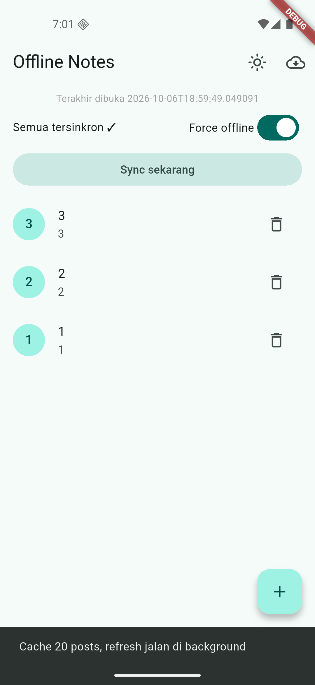

# notes-page
File: [notes-page](lib/pages/notes_page.dart)

# settings-page
File: [settings-page](lib/pages/settings_page.dart)

# Tugas utama
File: [tugas-utama](lib/main.dart)

---

# AI Prompt Challenge
## Prompt storage
### Perbandingan Storage Offline Notes
| Aspek | SharedPreferences | Hive | sqflite | Drift |
|-------|-------------------|------|---------|-------|
| Kode | Paling sedikit, tinggal get/set | Sedikit, tetapi perlu adapter | Sedang, sepadan untuk 1000+ baris | Paling besar, memakai build_runner |
| Query | Key-value saja, tidak dapat query koleksi | Filter dasar di memori | SQL penuh, ORDER BY dan WHERE dirty mudah | SQL type-safe + stream |
| Relasi | Tidak ada | Tidak ada | Ada JOIN jika nanti tambah tabel | Paling rapi + migrasi terstruktur |
| Reaktif | Tidak, baca manual | Ada watchBox sederhana | Tidak native, refresh memakai invalidate | Watch stream bawaan |
| Testing | Mudah | Sedang | Mudah via openDb injeksi | Agak rumit |
---
### Trade-off Koleksi Besar
| Aspek | SharedPreferences | sqflite |
|-------|-------------------|---------|
| Satu JSON besar | Setiap edit menulis ulang semuanya, satu korup hilang semua | Update per-baris, satu rusak yang lain aman |
| Sortir dan filter | Parse semua di memori dulu | ORDER BY dan WHERE langsung di query |
| Antrean sync | Tidak dapat per-item | WHERE dirty per-item mudah |
---
### Trade-off Reaktivitas
| Aspek | sqflite + invalidate | Drift + watch |
|-------|----------------------|---------------|
| Boilerplate | Kecil, tanpa generated code | Besar, tambah migrasi skema |
| Stream otomatis | Tidak ada, refresh manual | Ada, cocok query kompleks lintas tabel |
| Cocok untuk | CRUD notes sederhana | Aplikasi besar yang butuh reaktif penuh |
---
## Prompt penguatan konsep
Pilih SharedPreferences jika datanya nilai kecil primitif (misal: tema gelap/terang, terakhir dibuka) dan mengutamakan kode ringkas.
Pilih sqflite jika datanya koleksi 1000+ baris (misal: daftar catatan dari database) yang butuh query, update per-baris, dan antrean sync.

## Verification prompt

# Tugas dan Refleksi
Folder: [tugas](lib/)
### Checklist Verifikasi Mandiri
- [x] UI tidak memanggil SQLite/SharedPreferences langsung; semua lewat repository + provider.
- [x] Aplikasi penuh berfungsi dalam mode pesawat: baca, tambah, hapus catatan.
- [x] Badge dirty akurat sebelum/sesudah sync; cache posts tampil tanpa internet.
- [x] flutter analyze tanpa issue dan semua test lulus.
- [x] Hasil AI diverifikasi dan didokumentasikan pada folder docs/.
### Refleksi
1. Mengapa daftar catatan tidak boleh disimpan di SharedPreferences? Apa yang rusak jika aturan ini dilanggar?
   Karena menyimpan ribuan catatan sebagai satu file JSON akan membuat setiap perubahan kecil memaksa kita menulis ulang semuanya. Selain itu, tidak bisa mengurutkan atau memfilter data tanpa membebani memori, dan satu file yang rusak berarti seluruh data hilang.
2. Kapan cache-first cukup, dan kapan Anda membutuhkan strategi lain (misalnya network-first untuk data harga real-time)?
   Cache-first cocok untuk data yang tidak cepat dihapus, seperti catatan pribadi agar aplikasi terasa instan. Namun, network-first wajib untuk data kritis yang berubah tiap detik, seperti harga atau saldo. Menampilkan data lama di kasus ini bisa berakibat fatal, sehingga cache hanya digunakan jika jaringan benar-benar mati.
3. Bagaimana dirty flag berubah menjadi antrean sync tanpa memblokir UI? Kapan antrean terpisah (tabel outbox) menjadi perlu?
   Dengan menandai data yang diubah menjadi dirty=1 dan langsung memperbarui UI, sehingga pengguna tidak perlu menunggu jaringan. Sinkronisasi berjalan senyap di latar belakang. Namun, jika operasi menjadi kompleks dan urutannya sangat krusial, kita butuh tabel outbox terpisah agar antrean lebih rapi dan bisa di-retry per item.
4. Bagian mana dari rekomendasi AI yang Anda tolak, dan mengapa?
   Dua saran yang ditolak, yang pertama yaitu menyimpan catatan di SharedPreferences karena rentan rusak dan tidak bisa di-query. Kedua yaitu membuat CRUD tanpa dirty flag dan timestamp yang berisiko menimpa data secara paksa saat sinkronisasi.

