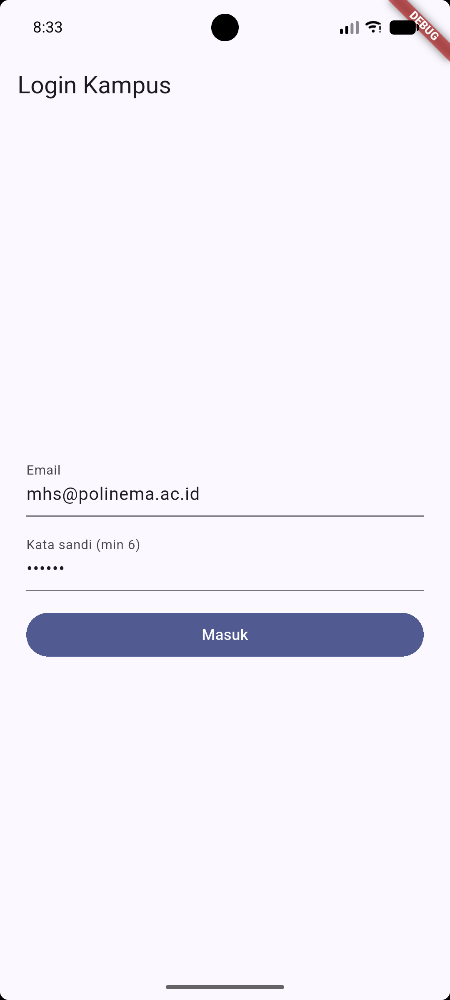
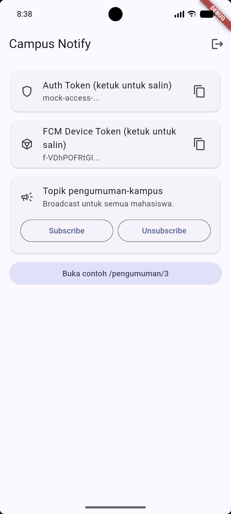
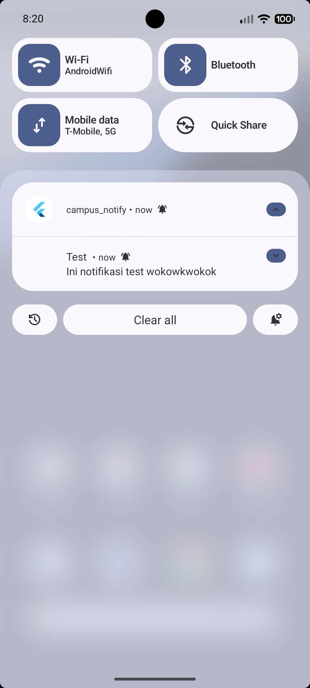
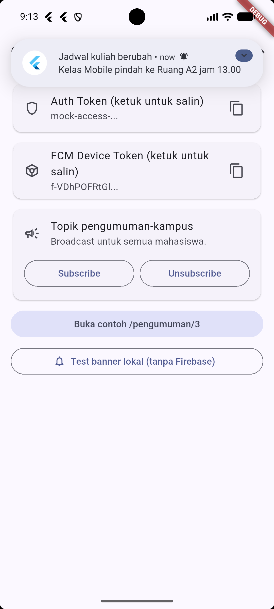
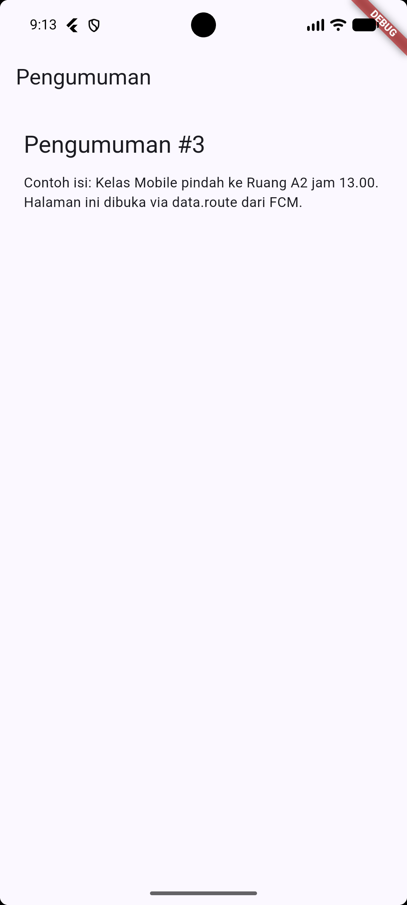

# login-page
File: [login-page](lib/pages/login_page.dart)

# home-page
File: [home-page](lib/pages/home_page.dart)

# Tugas utama
File: [tugas-utama](lib/main.dart)

---

# AI Prompt Challenge
## Prompt auth dan push
### Perbandingan Penyimpanan Token
| Aspek | SharedPreferences | flutter_secure_storage |
|-------|-------------------|------------------------|
| Enkripsi | Tidak ada, teks polos | Ada, Keychain/Keystore |
| Cocok untuk | Pengaturan biasa | Token dan secret |
| Risiko bocor | Dibaca aplikasi lain yang di-root | Tetap aman di penyimpanan sistem |
---
### Trade-off Token Refresh
| Aspek | Tanpa refresh | Refresh otomatis sekali |
|-------|---------------|-------------------------|
| 401 expired | Pengguna login ulang manual | Ditukar diam-diam lalu request diulang |
| Refresh ikut mati | Sama saja | Dipaksa logout dan kembali ke login |
---
### Trade-off Payload Notifikasi
| Aspek | notification saja | notification + data |
|-------|-------------------|---------------------|
| Banner background | Muncul otomatis | Muncul otomatis |
| Klik bisa deep link | Tidak, tujuan tidak terbawa | Bisa, lewat data.route |
---
## Prompt penguatan konsep
Kirim notification + data jika pesan butuh banner sekaligus tujuan klik (misal: pengumuman kampus ke /pengumuman/3).
Kirim token perangkat jika pesan bersifat personal (misal: nilai, tagihan), dan topik jika broadcast (misal: semua mahasiswa).

## Verification prompt

### Matriks pengujian tiga app state
| State | Yang diharapkan | Cara uji |
|-------|-----------------|----------|
| Foreground | Banner lokal muncul, klik masuk ke /pengumuman/3 | Aplikasi terbuka, kirim dari console/backend |
| Background | Banner sistem muncul, klik masuk ke rute yang benar | Tekan Home, kirim, klik banner |
| Terminated | Aplikasi terbuka ke rute yang benar via getInitialMessage | Swipe-close aplikasi, kirim, klik banner |

# Refleksi
1. Mengapa refresh token tidak boleh disimpan di SharedPreferences? Apa risikonya bila bocor?
   Menyimpannya di SharedPreferences karena tidak terenkripsi sehingga bisa dibaca aplikasi lain di HP yang di-root. Jika bocor peretas bisa terus memperpanjang akses tanpa perlu login ulang yang berujung pada pengambilalihan akun secara permanen.
2. Apa yang rusak bila onTokenRefresh diabaikan selama satu semester perkuliahan?
   Token perangkat bisa berubah kapan saja misalnya saat reinstall atau pembaruan sistem. Jika listener pembaruan token diabaikan, backend akan terus menyimpan alamat yang sudah tidak dipakai. Akibatnya selama satu semester penuh pengguna tidak akan menerima notifikasi apa pun karena pesan terus dikirim ke alamat yang salah.
3. Kapan memakai topik dan kapan memakai token perangkat? Beri contoh pesan kampus untuk masing-masing.
   Untuk siaran massal ke banyak orang sekaligus seperti pengumuman libur ke topik pengumuman-kampus. Gunakan token perangkat untuk pesan personal yang ditujukan spesifik ke satu individu seperti notifikasi nilai ujian atau tagihan UKT yang hanya boleh dilihat oleh mahasiswa bersangkutan.
4. Bagian mana dari draf AI yang ditolak atau diperbaiki, dan mengapa?
   Tiga hal yang diperbaiki yang pertama yaitu mengubah background handler menjadi fungsi top-level khusus karena ia berjalan di isolate terpisah. Yang kedua mengirim token langsung ke backend bukan sekadar mencetaknya di log. Yang ketiga memunculkan notifikasi manual saat aplikasi terbuka karena sistem bawaan tidak akan menampilkan banner jika aplikasi sedang aktif di layar.

### Checklist Verifikasi
- [x] Token hanya di flutter_secure_storage, tidak di SharedPreferences/log/screenshot penuh.
- [x] 401 memicu refresh sekali lalu retry; refresh mati memaksa login ulang.
- [x] Ketiga app state teruji dengan tabel bukti; klik masuk ke rute yang benar.
- [x] Topik untuk broadcast, token untuk pesan personal.
- [x] flutter analyze bersih dan semua test lulus.

